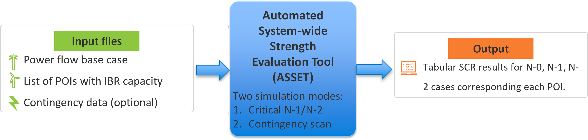

# ⚡ Automated Systemwide Strength Evaluation Tool (ASSET)

**ASSET** is a free and open-source tool built with Python and [PSS®E](https://new.siemens.com/global/en/products/energy/services/transmission-distribution-smart-grid/pss-software/pss-e.html), designed to automatically assess and analyze grid strength across large-scale power systems. It supports multiple system operating conditions and contingencies, and outputs results in a tabular format for easy interpretation.

National Renewable Energy Laboratory - Software Record Number - SWR-24-03

---

## 🚀 Features

- ✅ **Automated grid strength computation** for a list of given buses or Points of Interconnection (POIs).
- ⚠️ **Identify critical network contingencies** impacting grid strength at selected buses/POI.
- 🔍 **Analyze the impact of pre-determined contingencies** on system strength at specified buses.
- 🧮 **SCRIF** – Interaction Factor-based Short-Circuit Ratio computation that accounts for voltage sensitivity of neighboring POIs, providing a more conservative and realistic assessment of system strength.
- 📍 **Optimal sizing and location of grid strengthening devices** _(coming soon)_.

---

## 🖼️ Workflow Overview




---

## 🧪 Applications

ASSET has been used in the analysis of real-world power systems, including:

1. [Grid strength studies for U.S. Eastern Interconnect](https://www.nrel.gov/docs/fy24osti/88003.pdf) 🌐
2. [Puerto Rico grid resiliencey studies](https://www.nrel.gov/docs/fy24osti/88615.pdf) 🇵🇷
3. [Grid strength studies for U.S. Western Interconnect (WECC) system](https://www.osti.gov/servlets/purl/2500279/) 🌐
4. [Subnational strategies to improve grid quality and reduce energy costs in Argentina](https://www.nrel.gov/docs/fy25osti/91767.pdf) 🇦🇷

---

## 📚 Citation


If you use ASSET in your research or publications, please cite the following papers:
```bash
P. Sharma and S. Shah, "Application of the Extra Element Theorem for Grid Strength Analysis in IBR-Dominated Systems," 2025 IEEE Power & Energy Society General Meeting (PESGM), Austin, Texas, USA, 2025
```

---

## 📝 License

ASSET is released under the **BSD License**.  Copyright © Alliance for Sustainable Energy LLC.

**NREL Software Record of Invention**  
Pranav Sharma, Shahil Shah, Bin Wang, Leonardo Rese –  “Automated System‑wide Strength Evaluation Tool (ASSET)”.

---

## ⚙️ Installation

**Clone the repository**

```bash
git clone https://github.com/NREL/ASSET.git
cd asset

```

---

## ✉️ Contact

For questions, feedback, or other inquiries, please reach out to **shahil.shah@nrel.gov**.

For our related work in the domain of Power systems stability, please visit:  [**Grid Impedance Scan Tool**](https://www.nrel.gov/grid/impedance-measurement)
         
---

## 🤝 Contributing

We welcome contributions of all kinds—code, documentation, testing, or feature suggestions.

1. **Fork** the repository and create your branch from `main`.
2. **Commit** your changes with clear messages.
3. **Open a Pull Request** (PR) describing what you changed and why.
4. One of the maintainers will review your PR, suggest any revisions, and merge when ready.

If you’d like to discuss an idea before coding, please open an **Issue** or email us directly at **shahil.shah@nrel.gov**.

> **New to Git or GitHub?** Check out the [GitHub Docs “Fork a repo” guide](https://docs.github.com/en/get-started/quickstart/fork-a-repo).

Thank you for helping make ASSET better!
